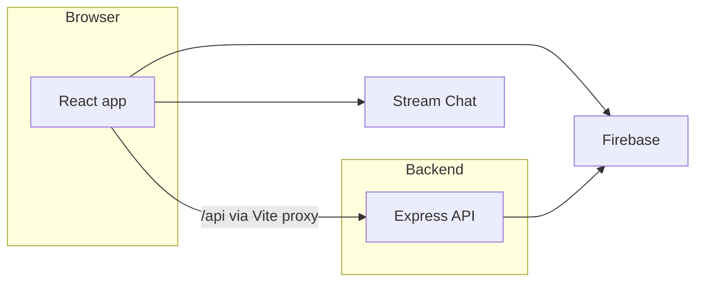

# Virtual Career Fair

Web application for virtual career fairs where **students**, **employers** (company owners and representatives), and **administrators** can connect. Companies create booths and listings; students browse fairs, visit booths, chat, and join video sessions; admins manage fairs and platform access.

## Architecture

| Layer | Technologies |
|--------|----------------|
| **Frontend** | React 19, TypeScript, Vite, Material UI, React Router, TanStack Query, Firebase client SDK |
| **Backend** | Node.js, Express 5, Firebase Admin, Stream Chat, optional AI/document tooling (e.g. resume features) |
| **Realtime & chat** | Stream Chat; HTTP API proxied from the dev server to the backend |
| **Data & auth** | Firebase (Firestore, Authentication, and related services as configured for your environment) |

REST handlers live under [`backend/routes`](backend/routes) and related modules; the UI consumes `/api` routes (see Vite proxy to port `5000` in [`frontend/vite.config.ts`](frontend/vite.config.ts)).



## Prerequisites

- **Node.js** 18+ (LTS recommended)
- **Firebase** project access for local development (credentials and rules aligned with your team’s setup)
- Optional: **Stream Chat** API key and secret for messaging (see [ENV_SETUP.md](ENV_SETUP.md))

## Setup

1. **Clone** the repository and use the **`dev`** branch for day-to-day work (see **Branching and contributing** at the end of this file).

2. **Backend environment:** Create `backend/.env` with Stream Chat keys, admin secret, and any other variables your team uses. Step-by-step instructions: [ENV_SETUP.md](ENV_SETUP.md).

3. **Firebase service account:** Place your Google Cloud service account JSON locally where the backend expects it (often `backend/privateKey.json`). This file is **never** committed; it appears in [.gitignore](.gitignore).

4. **Firebase config in Git:** `firebase.json` and `firestore.rules` are **ignored** in this repository so environment-specific deployment metadata and full rule files are not committed. Use the [Firebase Console](https://console.firebase.google.com/) for your project, or copies shared securely by your team. Feature guides (for example [VIDEO_CHAT_IMPLEMENTATION_GUIDE.md](VIDEO_CHAT_IMPLEMENTATION_GUIDE.md)) describe rule changes you may need to apply.

5. **Admin / platform setup:** If you bootstrap admin users or platform secrets, see [ADMIN_SETUP.md](ADMIN_SETUP.md).

## Run locally

**Backend** (default [http://localhost:5000](http://localhost:5000)):

```bash
cd backend
npm install
npm start
```

**Frontend** (Vite dev server, default [http://localhost:5173](http://localhost:5173); `/api` is proxied to the backend):

```bash
cd frontend
npm install
npm run dev
```

Run both processes while developing so API calls from the UI succeed.

## Testing

```bash
cd backend && npm test
cd frontend && npm test
```

Coverage: `npm run test:coverage` in each package. More context: [TEST_COVERAGE_GUIDE.md](TEST_COVERAGE_GUIDE.md).

## Documentation

Project guides and specs are indexed in **[docs/README.md](docs/README.md)** (setup, features, testing, architecture notes, sprint artifacts).

## What we keep out of Git

Brief rationale for teaching and review (see [.gitignore](.gitignore) for the full list):

- **`node_modules/`** — dependencies are installed from lockfiles, not vendored.
- **`.env` and secrets** — API keys and admin secrets stay local; only examples belong in the repo.
- **`backend/privateKey.json`** — Firebase/service account credentials must not be published.
- **`firebase.json` / `firestore.rules`** — deployment-specific Firebase files stay out of the repo per team policy; rules are applied in the Firebase project or documented in guides.
- **Build, cache, and coverage outputs** — `dist`, `.cache`, `coverage`, etc. avoid noise and merge churn.
- **Local captures and scan reports** — e.g. `**/test-output*.txt`, `**/trivy*.html`.

## Branching and contributing

- **`dev`** — active integration branch.
- **`main`** — stable / release-oriented.

Workflow:

1. Branch off `dev` using `feature/<short-description>`.
2. Open pull requests **into `dev`** and request review before merge.

## License and status

Academic / course software project; see repository collaborators and course materials for licensing and attribution if required.
